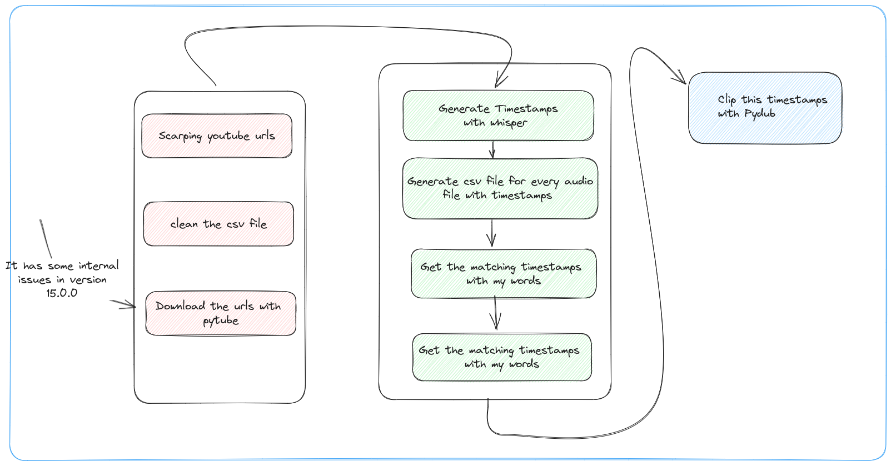

# Sariqat-al-Lahzat

## YouTube Transcription and Audio Clipping

This repository provides a set of tools and scripts for transcribing YouTube videos, extracting timestamps, generating subtitles, and clipping audio based on the subtitles. It aims to automate the process of extracting valuable information from YouTube videos and making it easily accessible.



## Features

- Automatic speech recognition to transcribe audio from YouTube videos.
- Extraction of timestamps from the transcribed text.
- Generation of subtitles in SRT format.
- Searching for specific words in the subtitles and extracting matching subtitles.
- Conversion of subtitles to CSV for further analysis.
- Clipping audio files based on subtitle timestamps.
- Powered by AI.

## Requirements

To use the tools and scripts in this repository, you need the following:

- Python 3.7 or higher
- `torch` and `transformers` libraries for speech recognition
- `pydub` library for audio processing
- `pandas` library for data manipulation
- `youtube-dl` library for downloading YouTube videos

Make sure you have these dependencies installed before running the scripts.

## Usage

1. Clone the repository to your local machine:

   ```bash
   git clone https://github.com/your-username/Sariqat-al-Lahzat.git
   ```
```python
pip install torch transformers pydub pandas youtube-dl
```
2. Run the scripts in the repository to perform different tasks such as transcribing, generating subtitles, searching for specific words, and clipping audio. Make sure to provide the necessary input files and parameters as required by each script.

3. Customize and extend the functionality of the scripts according to your specific needs.


